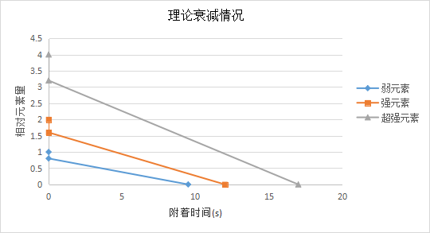
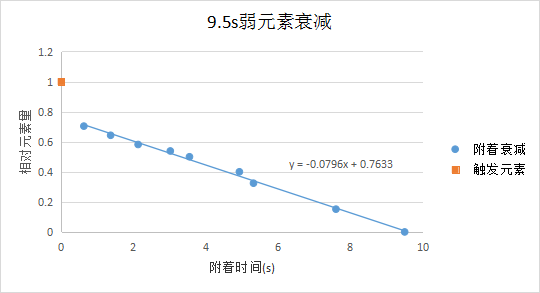
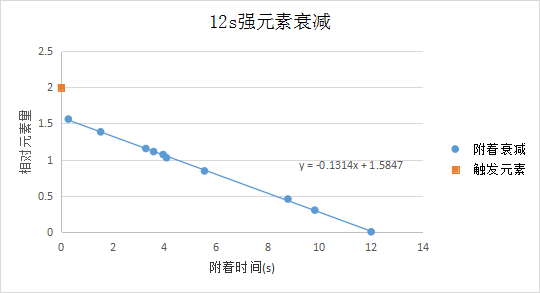
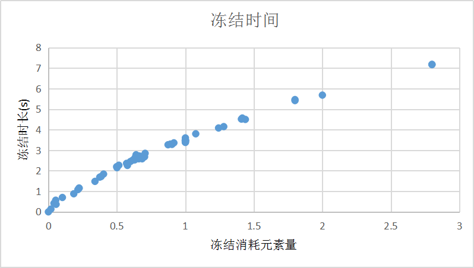
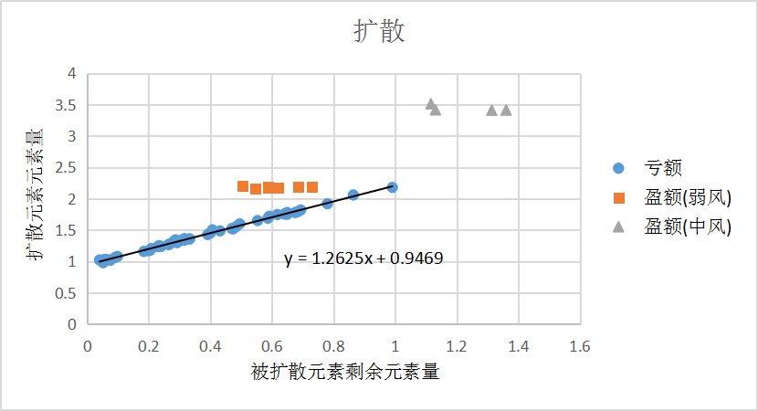

# 高等元素论

## 前言

　　- 本文搬运自[《高等元素论》(正式版ver1.6)](https://bbs.nga.cn/read.php?tid=24400590)，鸣谢等内容请见原文链接。
  - 请结合[**元素附着时间**](高等元素论_附录_全角色施加元素的附着时间.md)、[**元素反应中的元素残留**](高等元素论_附录_元素反应.md)与[**元素附着时间叠加**](高等元素论_附录_同元素叠加.md)一同食用。
  - 破盾/甲内容可参考[**《普通破盾学》**](普通破盾学.md)与[**《普通破盾学》续**](普通破盾学_续篇.md)。
  - **草元素反应相关内容还请移步**[《高等元素论(附录)》——草元素反应](高等元素论_附录_草元素反应.md)**查看。**

## 一、元素量与附着时间

### 1.1 附着元素和触发元素

游戏中的元素可以大体分为两种情况：

　　1.只存在一瞬的**触发元素**，即触发反应的元素（包括反应破盾）。例如对一个附着水的目标上火会触发蒸发反应，此时火元素便为**触发元素**

　　2.会持续存在的**附着元素**，附着到目标身上可持续存在的元素即为**附着元素**

　　**文字理解：对于角色对敌对单位施加的元素，其只有作为触发元素时才可能且一定拥有100%的最大元素量，附着元素最多只拥有约80%的最大元素量**

　　图像理解请参考1.4中的内容，可理解为一分段函数。

　　游戏中带有伤害的元素大多具有与角色对敌对单位施加元素相同的规律（称为**伤害元素**），即附着元素最多只具有约80%的最大元素量，**伤害元素**的最大元素量与最长附着时间符合公式关系。但对于角色自身附着（例如芭芭拉的水环给角色上水）和一些不带伤害的元素（例如海水），这些元素无论作为触发元素还是附着元素所可以拥有的最大元素量都为100%的最大元素量，且他们的最大元素量与最长附着时间之间无明显公式关系。这里暂不展开叙述其他情况，本帖以角色对敌对单位施加元素与触发反应为主。

### 1.2 元素量与消耗量

　　元素量为元素本身所具有的且确切存在于游戏中的一种数值，是量化元素的必要工具。同种元素的反复叠加附着不存在反应，为附着元素间的元素量叠加覆盖。元素反应中，触发元素会消耗附着元素的元素量，我们称附着元素被消耗的元素量数值为反应消耗量，这一点对反应破盾的情况同样适用。“强度”不同的元素所对应的最长持续时间与最大元素量不同，最大元素量为元素作为触发元素时所具有的元素量，最长附着时间为元素作为附着元素所能单独存在的最长时间，具体数据详见元素附着时间。

　　假设除草元素外**最弱的原生伤害元素**具有的**最大元素量**为1（下同），那么有如下的对应关系：

|                        | **弱元素** | **强元素** | **超强元素** |
| :--------------------: | :--------: | :--------: | :----------: |
| **最长附着时间（秒）** |    9.5     |     12     |      17      |
|     **最大元素量**     |     1      |     2      |      4       |

　　**特别说明**：

　　1. 游戏1.3更新后修改了扩散反应的机制，具体内容详见元素反应中的扩散反应部分。

　　2. 上述对于元素的分类仅针对**角色施加的原生元素**(**原生元素**即最初始的元素本身，不考虑受例如反应影响后的情况)，游戏中的所有元素不只这三种分级（例如扩散可以产生无数种不同初始状态的元素）

### 1.3 风和岩

　　实际上游戏中的风和岩元素是被火/雷/冰/水四元素克制的，而风和岩暂不会发生反应。风/岩较为特殊，角色施加的风/岩元素无法附着，**仅能作为触发元素，又因为被克制，通常只能发挥50%的元素量效果**。所以角色施加的风/岩也符合上述元素强弱分类。

### 1.4 元素衰减

　　元素量会随附着时间的增加而衰减，附着衰减的情况仅会出现在**附着元素**上

　　**图像理解附着元素和触发元素：1. x=0时，y=b 2. x >0时，y=kx+0.8b(k<0,b>0)**

    
测试数据

    
    

### 1.5 元素的主次

　　元素反应与叠加中的元素有主次之分，第一个附着的元素即为**主元素**，后续元素均为**次元素**。

　　在**同元素叠加**中，主次元素均为**附着元素**。**衰减速度**会以主元素的衰减速度衰减，次元素均仅负责补充元素量而不会改变**衰减速度**。

　　在**元素反应**中，主元素即为**附着元素**，次元素即为**触发元素**。只有主元素会残留，后续的次元素只消耗主元素元素量而不会残留。即便次元素的元素量多于主元素的剩余元素量，次元素也不会残留。（感电反应除外，会在元素反应中提到）

## 二、同元素叠加

### 叠加机制理论

　　**当补充元素的元素量大于剩余元素的元素量时，该元素的元素量会更新为补充元素的元素量（小于则不更新，即二者选其多），但是更新元素量不会改变主元素的衰减速度**。
**衰减速度**：元素原始状态衰减的速度。例如，9.5s弱元素附着时最多具有约0.8的元素量，那么其衰减速度为每秒衰减0.8/9.5=8/95的元素量。如果被一12s元素补充，12s元素叠加补充的元素量为1.6，那么叠加后的元素衰减完所需时间为1.6/(8/95)=19s。

　　本条不再举例，可参考[**元素附着时间叠加机制**](高等元素论_附录_同元素叠加.md)中的数据。

## 三、元素反应

### 3.1 元素反应机制理论

　　元素反应中**次元素**会消耗**主元素**的元素量，如果反应后主元素的剩余元素量不为0则会继续残留至消耗完毕。主元素与次元素的元素量消耗之比，在两元素无克制关系时为1:1。但当两元素间存在克制关系时，元素消耗关系为，克制元素:被克制元素=1:2。例如雷冰间无克制关系，1点雷会消耗1点冰（冰足量）；水克制火，那么1点水可以消耗2点火（火足量）。（感电反应较为特殊）

　　还有一点需要注意，两元素反应消耗的比例关系在某些情况中存在特殊的机制性设定，例如某些怪物的护盾的反应消耗并不满足无克制1:1和克制1:2的关系，也就是不存在一般意义上的克制关系而是单独设定，故我们不将其归为一般意义上的元素克制。比如经常有玩家提到的“冰克雷”来源于冰元素反应破愚人众雷锤前锋军的雷护甲，而雷锤前锋军是上述提到的特殊设定之一，也就是说“冰克雷”只存在于雷锤前锋军这一个单位而并不存在于其他的大多数情况中，所以一般来说我们不认为雷被冰克制。

　　**元素克制**：目前游戏中一般意义上的元素克制关系有：1.**水克制火** 2.**火克制冰** 3.**水/雷/冰/火克制风/岩**

### 3.2 增幅反应、剧变反应与结晶反应（不含感电反应）

　　结合上述理论与[**元素反应中的元素残留机制**](高等元素论_附录_元素反应.md)中的数据简单举几个例子便于大家理解。冻结与扩散反应在下面单独提到，并不是因为其不符合一般的反应规律，是因为他们还有其他的额外效果需要展开叙述。而感电是与常规反应不同才展开叙述。

    
例子

    <strong>例1.超导反应中12+9.5的反应</strong>
    

        &emsp;&emsp;此情况下，12s元素为主元素，9.5s元素为次元素，反应时9.5s元素最多会消耗掉主元素1的元素量。为判断主元素的剩余元素量与1的大小，需找到主元素衰减至1时的时间点。令上述公式y=-0.1314x+1.5847=1，求得x≈4.45s，实际测试数据为4.5s-4.6s。所以此情况下，附着时间在约4.6s前反应会残留主元素（<strong>需要注意，在约0.9s的反应结算时间内看不出残留</strong>），4.6s后反应则不残留元素。<strong>可认为反应消耗是令原图像向下平移对应消耗量的单位，从图像最右侧开始影响而不影响正在进行的左半端</strong>，所以残留情况下元素会残留至约4.6s
    

    <strong>例2.融化反应中12+9.5的反应</strong>
    

        &emsp;&emsp;12s元素为主元素，9.5s元素为次元素，由于火克冰，所以冰消耗火的元素量减半，火消耗冰的元素量翻倍。所以此情况只有先火后冰才可能残留火元素，而冰火顺序冰元素不会残留。9.5s的冰消耗12s火的消耗量为1的一半，即0.5。令0.5=-0.1314x+1.5847，求得x≈8.25s，实际测试数据为8.3s-8.4s。
    

    <strong>例3.结晶反应中9.5s元素+弱岩的反应</strong>
    

        &emsp;&emsp;弱岩的元素量为1，由于被克制而只消耗主元素0.5的元素量，9.5s元素对应的衰减为y=-0.0796x+0.7633，所以令0.5=-0.0796x+0.7633，求得x≈3.31s，实际测试数据为约3.5s。
    

### 3.3 感电反应

　　**感电反应结算机制**：**两元素地位平等，在反应期间共存，均为附着元素，每次结算同时减掉两元素各0.4的元素量，每进行一次结算造成一次感电伤害，直到有一元素被消耗完。**
　　**需要注意，两次结算之间有约1s的间隔，间隔期间依然会正常计算元素衰减。例如A水触发B雷感电，触发时B雷元素量还支持2次反应(即元素量大于0.4)，但1s后的元素量小于0.4，这种情况也只会触发一次感电，因为B雷会在第一次结算和第二次结算间的1s衰减完而无法继续反应。**
　　（似乎存在如果两元素附着时间相隔过近，会导致前一元素会被少消耗一轮但伤害正常触发的问题。感电还存在有时消耗一轮元素量后不造成此轮感电伤害的问题，此问题通常发生在中间轮次。原因不明）

    
例子

    <strong>例1.9.5+9.5的两种情况</strong>
    

        &emsp;&emsp;A.当前一元素的元素量尚未衰减至0.4时，两元素的元素量都支持结算两次，此时会跳两次感电伤害而两元素均不残留。
    

    

        &emsp;&emsp;B.当前一元素的元素量衰减至第二次结算前会低于0.4时(已附着时间在触发第一次感电时应小于约3.75s)，前一元素只支持进行一次结算而只造成一次感电伤害。后一元素在一次结算后被消耗0.4的元素量，故会残留约9.5x(0.4/0.8)=4.75s。注意，后一元素应从刚开始附着时开始计算时间，而非反应结算后。
    

    <strong>例2.12+9.5的三种情况</strong>
    

        &emsp;&emsp;A.12s元素的元素量未衰减至0.8时，跳两次感电伤害，12s元素残留而9.5s元素不残留，12s元素残留至约6s。
    

    

        &emsp;&emsp;B.12s元素的元素量衰减至低于0.8但不低于0.4时(已附着时间在触发第一次感电时应小于约8s)，会跳两次感电伤害而两元素均不残留，
    

    

        &emsp;&emsp;C.12s元素的元素量衰减至低于0.4时，会跳一次感电伤害而9.5s元素残留，会残留约4.75s。
    

### 3.4 冻结与碎冰反应

　　**详细的冻结相关内容请移步[冻结反应机制](高等元素论_附录_冻结反应机制.md)**

#### 3.4.1 简单介绍

　　首先要明确一点，与冰有关的元素有两种。一种是常见的冰（自由冰），是无法碎冰的；另一种是冻结状态的冰（冻结冰），是可以碎冰的，这点对怪物的冰盾也是一样。这两种状态的冰图标不同，但两者的性质基本相同，例如冻元素也克制风/岩，也被火克制。
一般冻结时会优先显示冻结冰，但这不意味着如果之前附着且残留的冰或水就不存在了，因为水/冰不会与冻元素反应，所以只要它们的元素量未衰减至0就仍会存在于目标身上，只不过不显示。同样，在冻结时也可以正常为目标附着新的水/冰元素。

　　**冻结反应消耗量指本次冻结中参与反应的元素量，即取决于水/冰二元素中量较少的那一方。**

#### 3.4.2 冻结时间

　　若以T表示某次冻结时长，D表示该次冻结的冻元素量，x表示该次冻结反应消耗量，则有如下对应公式：
$$
T=2\sqrt{5D+4}-4=2\sqrt{10x+4}-4
$$

#### 3.4.3 补充与总结

1. 冻元素量=2x冻结反应元素消耗量。
2. 冻元素衰减速度初始值(即一般情况下的最小值)为0.4元素量每秒，在冻结状态下衰减速率每秒增加0.1，在解冻状态下该速率每秒减少0.2直至初始值0.4。
3. 连续冻结会继承衰减速度，因此连续冻结会导致冻结时间越来越短。
4. 除连续冻结外，游戏内也存在个别影响冻结时长的因素，如水使徒开盾状态下具有80%的冻结抵抗。
5. 3.4.2中的公式仅仅适用于无冻结抵抗的单位在非连续冻结的单次冻结情况，考虑到连续冻结和冻结抵抗的完整公式请参考[冻结反应机制](高等元素论_附录_冻结反应机制.md)中的内容。

#### 3.4.4 碎冰阈值

　　当前版本内，碎冰反应存在最低碎冰阈值，当冻元素量小于约0.5-0.6时便无法触发碎冰反应，只会扣除冻元素量而无动画与伤害。

### 3.5 扩散反应

#### 3.5.1 几个用词

　　**扩散元素**：指扩散出去的元素

　　**被扩散元素**：指被风元素触发扩散反应的元素。

　　**盈额**：指发生扩散反应，附着元素剩余元素量大于等于风元素消耗量时，扩散元素具有的元素量

　　**亏额**：指发生扩散反应，附着元素剩余元素量小于风元素消耗量，扩散元素具有的元素量

#### 3.5.2 扩散机制

　　当附着元素剩余元素量大于等于风元素最大消耗量时，**扩散元素**具有**盈额**的元素量，弱风盈额约为2.2，强风盈额约为3.45；当附着元素剩余元素量小于风元素最大消耗量时，**扩散元素**具有**亏额**的元素量，亏额与反应时附着元素剩余的元素量呈线性相关，与风元素强弱无关，且亏额最小值为约1.0。

#### 3.5.3 盈亏图像

　　图像中的扩散元素元素量为作为**触发元素**的元素量，即最大值。理论公式为1.25x+0.95

#### 3.5.4 盈亏的关系

　　假定上图亏额对应直线为f(x)，不难发现对于弱风来说（具有1元素量，扩散反应时最多消耗0.5），盈额为f(1)，盈亏分界点为(0.5,f(0.5))，亏额为f(a) （其中a代表附着元素剩余的元素量）。对于强风来说(具有2元素量，扩散反应时最多消耗1)，盈额为f(2)，盈亏分界点为(1,f(1))，亏额为f(a)。

　　换句话说可以将**扩散元素**的元素量归纳为一个总结:

　　**1. 盈额时，f(x)的x取风元素的元素量**

　　**2. 亏额时，f(x)的x取被扩散元素的剩余元素量**

## 四、复杂元素反应

### 4.1 简单介绍

　　当前版本中存在部分复杂的元素反应，如元素共存的情况和风同时扩散的情况。本条主要介绍感电和冻结中的共存以及风的同时扩散这三个情况，并顺带提及风元素转化的优先级问题。

### 4.2 冻结中的三元素反应

　　冻结状态下单位仍可被附着有水/冰元素（反应残留或反应后新的附着），称这种元素为**藏元素**，同时称冻结元素为**冻元素**。当藏元素与冻元素同时存在时，与其余几种元素发生反应存在以下几条规律。

#### 4.2.1 反应规律

　　**规律一：碎冰反应优先于其他反应**

　　**规律二：风优先反应藏元素**

　　**规律三：火和雷优先反应藏冰元素其次是冻元素**

　　**规律四：先反应藏元素的情况，不足的量会由冻元素补充反应。先反应冻元素的情况，不足的量不会由藏元素补充反应。**

　　（岩元素会优先碎冰后结晶藏元素，水冰仍可补充冻结，这两种情况单一，不再单独纳入规律中）

    
规律解读

    <strong>规律一</strong>
    

        &emsp;&emsp;游戏中部分攻击方式可碎冰的同时带有元素，例如迪卢克的e。此情况下的攻击会先判定碎冰，之后再判定其他元素的情况。例如迪卢克e攻击一带有藏水元素的冻结单位，会触发碎冰+蒸发。
    

    <strong>规律二</strong>
    
&emsp;&emsp;扩散会优先消耗藏元素，详细内容在规律四解读。

    <strong>规律三</strong>
    

        &emsp;&emsp;火和雷会优先判定发生融化/超导反应，并且优先级藏冰>冻元素。例如对藏水的冻结单位用雷，会和冻元素触发超导，而不触发感电。再比如，对藏冰元素的冻结单位用火，会先消耗藏冰，不足的部分用冻元素补足，而造成只触发一次融化但消耗两部分元素的效果。
    

    <strong>规律四</strong>
    

        &emsp;&emsp;例1.用元素量为1的火打有藏冰的冻结单位，其中藏冰元素量为0.4，冻元素量足量，根据规律三火会优先和藏冰反应，因为火克冰，消耗0.4藏冰只需0.2火元素，剩余的0.8火元素则会与冻元素反应。
    

    

        &emsp;&emsp;例2.用元素量为1的风扩散有藏水的冻结单位，其中藏水元素量为0.3，冻元素足量，根据规律二风会先和藏元素反应，由于风被冰/水克制，消耗0.3的藏水需0.6的风元素量，剩下的0.4风元素量会再消耗0.2的冻元素。
    

    

        &emsp;&emsp;例3.用元素量为2的雷打有藏水的冻结单位，其中冻元素量为1，藏水元素量无所谓，根据规律三雷优先与冻元素反应，消耗完冻元素后单位解冻，尽管还剩余1的雷元素，也不会与藏水反应。
    

#### 4.2.2 补充

　　1. 按照上述规律，单次的雷/火附着是不可能在不碎冰的前提下，对冻结藏水单位触发感电/蒸发的。

　　2. 如果风元素扩散时藏元素量不足而消耗了一些冻元素，如藏元素为水，则本次扩散会触发两次，一次为藏元素的水扩散，一次为冻元素的冰扩散，对被扩散单位造成一冰一水两次扩散伤害，而对其他被扩散波及的单位造成冰水附着但只有一次冰伤害（因为扩散的水无伤害）。

　　如藏元素为冰元素，则只有一次冰扩散，因为冰和冻元素被扩散触发的都是冰扩散，所以视作两者同源。

### 4.3 感电中的三元素反应

#### 4.3.1 反应规律

　　感电反应结算中共存的雷/水与其他可反应元素反应时，会先消耗雷元素量（与雷水附着先后顺序无关），如果雷元素量不够反应完所有触发元素的量时，则触发元素剩余的量会消耗水元素进而触发下一次反应。（与上述冻结中的规律四前半相似）

    
三个例子

    

        例1.用元素量为1的火打共存的雷水，反应时雷元素量为1.2，水元素量为1，由于雷元素量大于火元素量且雷火无克制关系，故火只会消耗雷元素1的元素量触发超载而不会触发蒸发。
    

    

        例2.用元素量为1的火打共存的雷水，反应时雷元素量为0.8，水元素量为1，由于雷元素量小于火元素量且雷火无克制关系，故火在消耗0.8雷元素后仍剩0.2元素量，又由于火被水克制，所以会消耗水元素0.1的元素量，最终触发超载与蒸发。
    

    

        例3.用元素量为2的冰打共存的雷水，反应时雷元素量为0.8，水元素量为1，由于雷元素量小于冰元素量且雷冰无克制关系，故冰在消耗0.8雷元素后仍剩1.2的元素量与水反应，最终触发超导与冻结
    

#### 4.3.2 补充

1. 如果风元素扩散时雷元素量不足而消耗了一些水元素，则本次扩散会触发两次伤害，一次为雷元素的扩散伤害，一次为水元素的扩散伤害。

2. 火同时触发超载与蒸发的情况，会正常造成超载的伤害，且火自身的伤害也会按蒸发倍率提升。只触发超载的情况也正常造成伤害。

3. 冰同时触发超导与冻结的情况，尽管触发超导但不会造成超导伤害，冻结仍可正常进行。只触发超导的情况则可以正常造成超导伤害。

4. 岩元素结晶时，无论雷元素量是否足够，都只会产生一个雷晶片而无水晶片。

### 4.4 风的同时扩散与元素转化优先级

 #### 4.4.1 什么是同时扩散

　　当一个单位存在元素共存的情况或多个单位各附着有元素，此时对该单位或同时对多个附着有元素的单位用风触发扩散反应，**扩散元素**的附着将出现无序的情况，即系统无法判断这些扩散元素附着的先后顺序只能算作同时附着。这种情况下，会出现无法正常进行元素结算的问题，例如感电反应不会开始和增幅反应无倍率提升。

#### 4.4.2 同时扩散的同元素叠加

　　目前经过粗略测试，同时扩散的同元素叠加似乎不会进行叠加判定，而是单独选取较少的扩散元素进行附着，衰减速率也是单纯沿用所选取附着的扩散元素的衰减速率。

#### 4.4.3 同时扩散的简单反应

　　这里最简单的情况指，两个可反应元素被同时扩散附着到第三个未先附着有元素的单位上发生的单次反应。由于同时附着，两元素无法区分先后，所以两元素均有残留的可能，两者均按附着元素量计算，多者残留。但同时也存在上述所提到的异常情况，如火水、火冰同时附着，该次增幅反应无论哪个元素伤害都不会有增幅倍率的提升；如雷水同时附着，则感电反应不会触发，水雷两元素会一直保持共存附着状态。而冻结、超载等反应可正常触发。

#### 4.4.4 同时扩散的复杂情况

　　至于其他更加复杂的情况，如三种元素进行同时附着，亦或是两种元素同时附着且被附着单位先前挂有其他元素，这类复杂情况暂未进行深入测试，测试难度过大且实用性不高。

　　复杂情况中仅针对特定情况做了一小部分粗略的测试，对此有一点非常不负责的粗略总结

    
不负责的总结

    

        &emsp;&emsp;如果两元素同时附着到已挂有某一元素的单位上发生反应的话，我们称先挂有元素的单位为主体，那么
    

    <ol>
        <li>主体为火，反应顺序为冰，水</li>
        <li>主体为水，反应顺序为火，冰</li>
        <li>主体为冰，反应顺序为火，水</li>
    </ol>
    

        &emsp;&emsp;未进行雷相关测试，通过上述不靠谱结论进行外推，元素优先与克制的元素结算，其次是被克制的元素，最后是无克制关系的元素。鉴于元素转化存在火>水>雷>冰的关系，推测无克制关系的元素也可能按照该顺序依次结算反应。只是猜测，仅供参考。
    

#### 4.4.5 风元素转化优先级

　　某些风元素技能可以沾染其他元素进行元素转化，当转化判定同时存在多种元素时，元素的转化按照特定优先级进行判定，优先转化为高优先级的元素。

　　旅行者（风）的元素转化优先级为：**冰(冻)>火>水>雷**

　　其他风元素角色的元素转化优先级为：**火>水>雷>冰(冻)**

## 五、一些补充

### 5.1 破盾/甲

　　原神内针对例如法师无敌盾和愚人众减伤甲，破盾值采取的是**元素量消耗+伤害+破冰/岩额外元素消耗**的综合计算，消耗量会受单独设置系数与元素相克影响。减伤甲免疫所有伤害只按元素消耗量进行，所以下述测试在避免破冰影响下对骗骗花的冰甲进行。

### 5.2 如何得到衰减图像

　　在已知上面部分内容的前提下，选取冰骗骗花为测试对象，提前测试出9.5s雷元素一下破其一半的冰甲，12s雷元素一下破完，即12s雷元素的破甲值为9.5s雷元素的两倍。正式测试中，**在骗骗花给自己套上冰甲之前提前附着雷元素，此时与冰甲反应的是已经过衰减的元素**。不难发现破甲值按一定规律随附着时间增加而减少。通过衰减破甲与满额破甲的比值算出衰减后对应的元素量，最终得出上面的图像。

